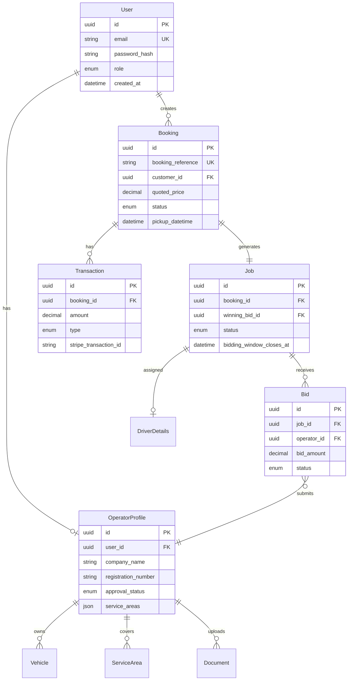

# DATABASE SCHEMA DOCUMENTATION

**Version:** 1.0
**Last Updated:** December 2025
**Database:** PostgreSQL 15+
**ORM:** Prisma 5+

---

## TABLE OF CONTENTS

1. [Overview](#overview)
2. [Entity-Relationship Diagram](#entity-relationship-diagram)
3. [Complete Prisma Schema](#complete-prisma-schema)
4. [Model Explanations](#model-explanations)
5. [Relationships](#relationships)
6. [Indexes & Performance](#indexes--performance)
7. [Sample Queries](#sample-queries)

---

## 1. OVERVIEW

### Database Design Principles

- **Normalization**: 3NF (Third Normal Form) to minimize data redundancy
- **Referential Integrity**: Foreign key constraints ensure data consistency
- **ACID Compliance**: Critical for financial transactions (payments, refunds, payouts)
- **Scalability**: Proper indexing for query performance
- **Audit Trail**: Created/updated timestamps on all tables
- **Soft Deletes**: Not implemented in MVP (hard deletes only)

### Naming Conventions

- **Tables**: Singular PascalCase in Prisma schema (e.g., `User`, `Booking`)
- **Columns**: snake_case in PostgreSQL (e.g., `first_name`, `created_at`)
- **Prisma Client**: Auto-maps to camelCase (e.g., `firstName`, `createdAt`)
- **Foreign Keys**: Suffix with `_id` (e.g., `user_id`, `operator_id`)
- **Booleans**: Prefix with `is_` or `has_` (e.g., `is_active`, `has_wheelchair_access`)
- **Timestamps**: Suffix with `_at` (e.g., `created_at`, `updated_at`, `completed_at`)

### Key Data Types

- **IDs**: UUID (universally unique identifier) for all primary keys
- **Decimals**: `Decimal` type for monetary values (precision: 10, scale: 2)
- **Timestamps**: `DateTime` with timezone support
- **Enums**: PostgreSQL enums for fixed value sets (UserRole, BookingStatus, etc.)
- **JSON**: `Json` type for flexible data (special requirements, metadata)

---

## 2. ENTITY-RELATIONSHIP DIAGRAM

### Core Entities

```
User (Customer/Operator/Admin)
  ↓
  ├─→ Booking (Customer creates booking)
  │     ↓
  │     ├─→ Job (Created from paid booking)
  │     │    ↓
  │     │    ├─→ Bid (Operators submit bids)
  │     │    │
  │     │    └─→ DriverDetails (Assigned after bid won)
  │     │
  │     └─→ Transaction (Payment, Refund)
  │
  └─→ OperatorProfile (If user role is OPERATOR)
        ↓
        ├─→ Vehicle (Operator's fleet)
        ├─→ ServiceArea (Regions covered)
        └─→ Document (License, Insurance)

PricingRule (Admin configures)
Notification (Email/SMS logs)
```

### Mermaid ER Diagram



---

## 3. COMPLETE PRISMA SCHEMA

Below is the complete Prisma schema ready to copy into `prisma/schema.prisma`:


```prisma
// This is your Prisma schema file
// Learn more: https://pris.ly/d/prisma-schema

generator client {
  provider = "prisma-client-js"
}

datasource db {
  provider = "postgresql"
  url      = env("DATABASE_URL")
}

// ============================================
// ENUMS
// ============================================

enum UserRole {
  CUSTOMER
  OPERATOR
  ADMIN
}

enum OperatorApprovalStatus {
  PENDING
  APPROVED
  REJECTED
  SUSPENDED
}

enum BookingStatus {
  PENDING_PAYMENT
  PAID
  ASSIGNED
  IN_PROGRESS
  COMPLETED
  CANCELLED
  REFUNDED
}

enum JobStatus {
  OPEN_FOR_BIDDING
  BIDDING_CLOSED
  ASSIGNED
  IN_PROGRESS
  COMPLETED
  CANCELLED
  NO_BIDS_RECEIVED
}

enum BidStatus {
  PENDING
  WON
  LOST
  WITHDRAWN
}

enum VehicleType {
  SALOON
  ESTATE
  MPV
  EXECUTIVE
  MINIBUS
}

enum ServiceType {
  AIRPORT_PICKUP
  AIRPORT_DROPOFF
  POINT_TO_POINT
}

enum TransactionType {
  CUSTOMER_PAYMENT
  OPERATOR_PAYOUT
  REFUND
  PLATFORM_COMMISSION
}

enum TransactionStatus {
  PENDING
  COMPLETED
  FAILED
  CANCELLED
}

enum NotificationType {
  EMAIL
  SMS
}

enum NotificationStatus {
  PENDING
  SENT
  FAILED
  BOUNCED
}

// ============================================
// MODELS
// ============================================

model User {
  id                String    @id @default(uuid()) @db.Uuid
  email             String    @unique
  password_hash     String
  role              UserRole  @default(CUSTOMER)
  first_name        String?
  last_name         String?
  phone_number      String?
  is_email_verified Boolean   @default(false)
  is_active         Boolean   @default(true)
  created_at        DateTime  @default(now())
  updated_at        DateTime  @updatedAt

  // Relations
  bookings          Booking[]
  operator_profile  OperatorProfile?
  notifications     Notification[]

  @@index([email])
  @@index([role])
  @@map("users")
}

model OperatorProfile {
  id                    String                  @id @default(uuid()) @db.Uuid
  user_id               String                  @unique @db.Uuid
  company_name          String
  registration_number   String                  @unique
  vat_number            String?
  approval_status       OperatorApprovalStatus  @default(PENDING)
  reputation_score      Decimal                 @default(0) @db.Decimal(3, 2) // 0.00 to 5.00
  bank_account_name     String?
  bank_account_number   String?
  bank_sort_code        String?
  created_at            DateTime                @default(now())
  updated_at            DateTime                @updatedAt

  // Relations
  user                  User                    @relation(fields: [user_id], references: [id], onDelete: Cascade)
  vehicles              Vehicle[]
  service_areas         ServiceArea[]
  documents             Document[]
  bids                  Bid[]

  @@index([user_id])
  @@index([approval_status])
  @@map("operator_profiles")
}

model Vehicle {
  id                String          @id @default(uuid()) @db.Uuid
  operator_id       String          @db.Uuid
  vehicle_type      VehicleType
  make              String
  model             String
  registration      String          @unique
  year              Int
  color             String?
  passenger_capacity Int
  luggage_capacity  Int
  is_active         Boolean         @default(true)
  created_at        DateTime        @default(now())
  updated_at        DateTime        @updatedAt

  // Relations
  operator          OperatorProfile @relation(fields: [operator_id], references: [id], onDelete: Cascade)

  @@index([operator_id])
  @@index([vehicle_type])
  @@map("vehicles")
}


model ServiceArea {
  id              String          @id @default(uuid()) @db.Uuid
  operator_id     String          @db.Uuid
  postcode_prefix String          // e.g., "SW1", "M1", "B1"
  region_name     String?         // e.g., "Greater London", "Manchester"
  created_at      DateTime        @default(now())

  // Relations
  operator        OperatorProfile @relation(fields: [operator_id], references: [id], onDelete: Cascade)

  @@index([operator_id])
  @@index([postcode_prefix])
  @@map("service_areas")
}

model Document {
  id              String          @id @default(uuid()) @db.Uuid
  operator_id     String          @db.Uuid
  document_type   String          // "OPERATING_LICENSE", "INSURANCE", "OTHER"
  file_url        String          // S3 or Cloudinary URL
  file_name       String
  file_size       Int             // in bytes
  uploaded_at     DateTime        @default(now())

  // Relations
  operator        OperatorProfile @relation(fields: [operator_id], references: [id], onDelete: Cascade)

  @@index([operator_id])
  @@map("documents")
}

model Booking {
  id                      String        @id @default(uuid()) @db.Uuid
  booking_reference       String        @unique // e.g., "BK123456"
  customer_id             String        @db.Uuid
  status                  BookingStatus @default(PENDING_PAYMENT)

  // Journey Details
  service_type            ServiceType
  pickup_address          String
  pickup_postcode         String
  pickup_lat              Decimal       @db.Decimal(10, 8)
  pickup_lng              Decimal       @db.Decimal(11, 8)
  dropoff_address         String
  dropoff_postcode        String
  dropoff_lat             Decimal       @db.Decimal(10, 8)
  dropoff_lng             Decimal       @db.Decimal(11, 8)
  pickup_datetime         DateTime

  // Passenger & Vehicle
  passenger_count         Int
  luggage_count           Int
  vehicle_type            VehicleType

  // Optional Fields
  flight_number           String?       // TEXT ONLY - no API integration
  terminal                String?
  has_meet_and_greet      Boolean       @default(false)
  special_requirements    Json?         // { childSeats: 2, wheelchairAccess: true, pets: false }
  via_points              Json?         // Array of intermediate stops

  // Pricing
  distance_miles          Decimal       @db.Decimal(10, 2)
  duration_minutes        Int
  quoted_price            Decimal       @db.Decimal(10, 2)
  is_return_journey       Boolean       @default(false)
  return_booking_id       String?       @db.Uuid

  // Customer Details
  customer_name           String
  customer_email          String
  customer_phone          String

  // Timestamps
  created_at              DateTime      @default(now())
  updated_at              DateTime      @updatedAt
  completed_at            DateTime?
  cancelled_at            DateTime?

  // Relations
  customer                User          @relation(fields: [customer_id], references: [id])
  job                     Job?
  transactions            Transaction[]
  return_booking          Booking?      @relation("ReturnJourney", fields: [return_booking_id], references: [id])
  outbound_booking        Booking?      @relation("ReturnJourney")

  @@index([booking_reference])
  @@index([customer_id])
  @@index([status])
  @@index([pickup_datetime])
  @@map("bookings")
}

model Job {
  id                          String    @id @default(uuid()) @db.Uuid
  booking_id                  String    @unique @db.Uuid
  status                      JobStatus @default(OPEN_FOR_BIDDING)

  // Bidding Window
  bidding_window_opens_at     DateTime  @default(now())
  bidding_window_closes_at    DateTime
  bidding_window_duration_hours Int     @default(24)

  // Winner Selection
  winning_bid_id              String?   @unique @db.Uuid
  platform_margin             Decimal?  @db.Decimal(10, 2) // Customer Price - Winning Bid

  // Assignment
  assigned_at                 DateTime?

  // Timestamps
  created_at                  DateTime  @default(now())
  updated_at                  DateTime  @updatedAt
  completed_at                DateTime?

  // Relations
  booking                     Booking   @relation(fields: [booking_id], references: [id], onDelete: Cascade)
  bids                        Bid[]
  winning_bid                 Bid?      @relation("WinningBid", fields: [winning_bid_id], references: [id])
  driver_details              DriverDetails?

  @@index([booking_id])
  @@index([status])
  @@index([bidding_window_closes_at])
  @@index([winning_bid_id])
  @@map("jobs")
}

model Bid {
  id              String          @id @default(uuid()) @db.Uuid
  job_id          String          @db.Uuid
  operator_id     String          @db.Uuid
  bid_amount      Decimal         @db.Decimal(10, 2)
  status          BidStatus       @default(PENDING)
  notes           String?         // Optional notes from operator
  created_at      DateTime        @default(now())
  updated_at      DateTime        @updatedAt

  // Relations
  job             Job             @relation(fields: [job_id], references: [id], onDelete: Cascade)
  operator        OperatorProfile @relation(fields: [operator_id], references: [id], onDelete: Cascade)
  won_job         Job?            @relation("WinningBid")

  @@unique([job_id, operator_id]) // One bid per operator per job
  @@index([job_id])
  @@index([operator_id])
  @@index([status])
  @@map("bids")
}

model DriverDetails {
  id                  String   @id @default(uuid()) @db.Uuid
  job_id              String   @unique @db.Uuid
  driver_name         String
  driver_phone        String
  vehicle_registration String
  vehicle_make        String?
  vehicle_model       String?
  vehicle_color       String?
  created_at          DateTime @default(now())
  updated_at          DateTime @updatedAt

  // Relations
  job                 Job      @relation(fields: [job_id], references: [id], onDelete: Cascade)

  @@index([job_id])
  @@map("driver_details")
}

model Transaction {
  id                      String            @id @default(uuid()) @db.Uuid
  booking_id              String            @db.Uuid
  type                    TransactionType
  status                  TransactionStatus @default(PENDING)
  amount                  Decimal           @db.Decimal(10, 2)
  currency                String            @default("GBP")
  stripe_transaction_id   String?           @unique
  stripe_payment_intent_id String?          @unique
  description             String?
  metadata                Json?             // Additional transaction metadata
  created_at              DateTime          @default(now())
  updated_at              DateTime          @updatedAt
  completed_at            DateTime?

  // Relations
  booking                 Booking           @relation(fields: [booking_id], references: [id], onDelete: Cascade)

  @@index([booking_id])
  @@index([type])
  @@index([status])
  @@index([stripe_transaction_id])
  @@map("transactions")
}

model PricingRule {
  id                  String   @id @default(uuid()) @db.Uuid
  rule_type           String   // "BASE_FARE", "PER_MILE", "TIME_SURCHARGE", "HOLIDAY_SURCHARGE", "AIRPORT_FEE"
  vehicle_type        VehicleType?
  base_amount         Decimal  @db.Decimal(10, 2)
  percentage          Decimal? @db.Decimal(5, 2) // For surcharges (e.g., 50.00 for 50%)

  // Time-based rules
  start_time          String?  // "22:00" for 10pm
  end_time            String?  // "06:00" for 6am

  // Date-based rules
  start_date          DateTime?
  end_date            DateTime?

  // Airport-specific
  airport_code        String?  // "LHR", "LGW", "STN", etc.

  is_active           Boolean  @default(true)
  created_at          DateTime @default(now())
  updated_at          DateTime @updatedAt

  @@index([rule_type])
  @@index([vehicle_type])
  @@index([is_active])
  @@map("pricing_rules")
}

model Notification {
  id              String             @id @default(uuid()) @db.Uuid
  user_id         String             @db.Uuid
  type            NotificationType
  status          NotificationStatus @default(PENDING)
  recipient_email String?
  recipient_phone String?
  subject         String?
  message         String
  template_id     String?            // Email template ID (SendGrid)
  metadata        Json?              // Additional data (booking_id, job_id, etc.)
  sent_at         DateTime?
  failed_at       DateTime?
  error_message   String?
  created_at      DateTime           @default(now())

  // Relations
  user            User               @relation(fields: [user_id], references: [id], onDelete: Cascade)

  @@index([user_id])
  @@index([type])
  @@index([status])
  @@map("notifications")
}
```

---

## 4. MODEL EXPLANATIONS

### User Model

**Purpose**: Central authentication and user management for all roles (Customer, Operator, Admin).

**Key Fields**:
- `id`: UUID primary key
- `email`: Unique identifier for login
- `password_hash`: Bcrypt hashed password (never store plain text)
- `role`: Enum (CUSTOMER, OPERATOR, ADMIN) - determines access permissions
- `is_email_verified`: Email verification status (for security)
- `is_active`: Soft deactivation flag (admin can deactivate accounts)

**Relationships**:
- One-to-Many with `Booking` (customers create bookings)
- One-to-One with `OperatorProfile` (if role is OPERATOR)
- One-to-Many with `Notification`

**Business Rules**:
- Email must be unique across all users
- Password must be hashed using bcrypt (min 10 rounds)
- Default role is CUSTOMER
- Email verification required before certain actions (optional for MVP)

---

### OperatorProfile Model

**Purpose**: Extended profile for transport operators with company details and approval workflow.

**Key Fields**:
- `user_id`: Foreign key to User (one-to-one relationship)
- `company_name`: Legal business name
- `registration_number`: Unique company registration (e.g., Companies House number)
- `approval_status`: Enum (PENDING, APPROVED, REJECTED, SUSPENDED)
- `reputation_score`: Decimal 0.00-5.00 (used as tiebreaker in bidding)
- `bank_account_*`: Bank details for payouts

**Relationships**:
- One-to-One with `User`
- One-to-Many with `Vehicle` (operator's fleet)
- One-to-Many with `ServiceArea` (regions covered)
- One-to-Many with `Document` (uploaded documents)
- One-to-Many with `Bid` (bids submitted)

**Business Rules**:
- Operator must be APPROVED before they can view jobs and submit bids
- Admin can SUSPEND operators (prevents bidding but preserves data)
- Reputation score starts at 0.00, increases with completed jobs
- Bank details required before first payout

---

### Booking Model

**Purpose**: Customer's booking request with journey details and pricing.

**Key Fields**:
- `booking_reference`: Unique alphanumeric code (e.g., "BK123456") - customer-facing ID
- `status`: Enum tracking booking lifecycle (PENDING_PAYMENT → PAID → ASSIGNED → COMPLETED)
- `pickup_*` / `dropoff_*`: Full address, postcode, and coordinates (lat/lng)
- `pickup_datetime`: When customer wants to be picked up
- `quoted_price`: Final price customer paid (includes all surcharges, discounts)
- `flight_number`: TEXT ONLY - no API integration, no validation
- `special_requirements`: JSON field for flexible data (child seats, wheelchair, pets)
- `via_points`: JSON array of intermediate stops

**Relationships**:
- Many-to-One with `User` (customer)
- One-to-One with `Job` (created after payment)
- One-to-Many with `Transaction` (payment, refund)
- Self-referencing for return journeys (outbound ↔ return)

**Business Rules**:
- Booking reference must be unique and easily readable (avoid ambiguous characters)
- Status transitions: PENDING_PAYMENT → PAID (after Stripe payment) → ASSIGNED (after bid won) → IN_PROGRESS → COMPLETED
- Quoted price is immutable after payment (no price changes)
- Return journey gets 5% discount applied to quoted_price

---

### Job Model

**Purpose**: Represents a paid booking that is broadcast to operators for bidding.

**Key Fields**:
- `booking_id`: One-to-one with Booking (created when booking status = PAID)
- `status`: Enum (OPEN_FOR_BIDDING, BIDDING_CLOSED, ASSIGNED, etc.)
- `bidding_window_closes_at`: Deadline for bid submissions
- `bidding_window_duration_hours`: Configurable (2-24 hours based on urgency)
- `winning_bid_id`: Foreign key to winning Bid (null until winner selected)
- `platform_margin`: Calculated as (Customer Price - Winning Bid Amount)

**Relationships**:
- One-to-One with `Booking`
- One-to-Many with `Bid` (operators submit bids)
- One-to-One with `Bid` (winning bid)
- One-to-One with `DriverDetails` (assigned after bid won)

**Business Rules**:
- Job created automatically when Booking status changes to PAID
- Bidding window duration calculated based on pickup_datetime (shorter window for urgent jobs)
- Status changes to BIDDING_CLOSED when window expires
- Winner selected automatically: lowest bid wins (tiebreaker: reputation_score)
- If no bids received: status = NO_BIDS_RECEIVED, escalate to admin

---

### Bid Model

**Purpose**: Operator's bid submission for a job.

**Key Fields**:
- `job_id`: Foreign key to Job
- `operator_id`: Foreign key to OperatorProfile
- `bid_amount`: Operator's proposed price (must be ≤ customer's quoted_price)
- `status`: Enum (PENDING, WON, LOST, WITHDRAWN)
- `notes`: Optional notes from operator (e.g., "Can provide luxury vehicle")

**Relationships**:
- Many-to-One with `Job`
- Many-to-One with `OperatorProfile`
- One-to-One with `Job` (if this bid wins)

**Business Rules**:
- Unique constraint: one bid per operator per job (@@unique([job_id, operator_id]))
- Bid amount must be ≤ booking.quoted_price (validated in backend)
- Bid amount must be > 0
- Operator can only bid if approval_status = APPROVED
- Operator can only bid if job is in their service area
- Operator can withdraw bid before bidding window closes (status = WITHDRAWN)
- All losing bids automatically set to status = LOST when winner selected

---

### Transaction Model

**Purpose**: Financial transaction log for payments, refunds, and payouts.

**Key Fields**:
- `booking_id`: Foreign key to Booking
- `type`: Enum (CUSTOMER_PAYMENT, OPERATOR_PAYOUT, REFUND, PLATFORM_COMMISSION)
- `status`: Enum (PENDING, COMPLETED, FAILED, CANCELLED)
- `amount`: Transaction amount in GBP
- `stripe_transaction_id`: Stripe charge/transfer ID for reconciliation
- `stripe_payment_intent_id`: Stripe Payment Intent ID

**Relationships**:
- Many-to-One with `Booking`

**Business Rules**:
- All financial transactions must be logged (audit trail)
- CUSTOMER_PAYMENT created when Stripe payment succeeds
- OPERATOR_PAYOUT created when payout processed (weekly/bi-weekly)
- REFUND created when booking cancelled (full or partial)
- PLATFORM_COMMISSION calculated as (Customer Payment - Operator Payout)
- Stripe IDs must be unique (for reconciliation)

---

### PricingRule Model

**Purpose**: Admin-configurable pricing rules for quote calculation.

**Key Fields**:
- `rule_type`: Type of pricing rule (BASE_FARE, PER_MILE, TIME_SURCHARGE, etc.)
- `vehicle_type`: Specific vehicle type (null for global rules)
- `base_amount`: Fixed amount (e.g., £5.00 base fare)
- `percentage`: Percentage for surcharges (e.g., 50.00 for 50% holiday surcharge)
- `start_time` / `end_time`: For time-based surcharges (e.g., night rates 22:00-06:00)
- `start_date` / `end_date`: For date-based surcharges (e.g., Christmas period)
- `airport_code`: For airport-specific fees (e.g., "LHR" = £5.00 fee)

**Business Rules**:
- Multiple rules can apply to a single quote (base fare + per-mile + surcharges)
- Rules are additive (all applicable rules are summed)
- Admin can activate/deactivate rules without deleting them
- Time-based rules use 24-hour format (HH:MM)

---

## 5. RELATIONSHIPS

### One-to-One Relationships

1. **User ↔ OperatorProfile**: Each operator user has exactly one profile
2. **Booking ↔ Job**: Each paid booking generates exactly one job
3. **Job ↔ DriverDetails**: Each assigned job has exactly one driver assignment
4. **Job ↔ Bid (winning)**: Each job has at most one winning bid

### One-to-Many Relationships

1. **User → Booking**: Customer can create multiple bookings
2. **OperatorProfile → Vehicle**: Operator can have multiple vehicles
3. **OperatorProfile → ServiceArea**: Operator can cover multiple regions
4. **OperatorProfile → Document**: Operator can upload multiple documents
5. **OperatorProfile → Bid**: Operator can submit multiple bids
6. **Job → Bid**: Each job can receive multiple bids
7. **Booking → Transaction**: Each booking can have multiple transactions (payment, refund)

### Self-Referencing Relationships

1. **Booking ↔ Booking (return journey)**: Outbound booking links to return booking

---

## 6. INDEXES & PERFORMANCE

### Index Strategy

**Primary Indexes (Automatic)**:
- All `@id` fields automatically indexed
- All `@unique` fields automatically indexed

**Custom Indexes Added**:

```prisma
// User
@@index([email])        // Login queries
@@index([role])         // Role-based filtering

// OperatorProfile
@@index([user_id])      // Join with User
@@index([approval_status]) // Filter approved operators

// Booking
@@index([booking_reference]) // Customer lookup
@@index([customer_id])  // Customer's bookings
@@index([status])       // Filter by status
@@index([pickup_datetime]) // Upcoming bookings

// Job
@@index([booking_id])   // Join with Booking
@@index([status])       // Filter open jobs
@@index([bidding_window_closes_at]) // Find expiring jobs
@@index([winning_bid_id]) // Join with winning bid

// Bid
@@index([job_id])       // Bids for a job
@@index([operator_id])  // Operator's bids
@@index([status])       // Filter by status

// Transaction
@@index([booking_id])   // Booking's transactions
@@index([type])         // Filter by type
@@index([status])       // Filter by status
@@index([stripe_transaction_id]) // Stripe reconciliation
```

### Performance Considerations

1. **Composite Indexes**: Consider adding composite indexes for common query patterns:
   - `@@index([status, pickup_datetime])` on Booking (filter + sort)
   - `@@index([job_id, status])` on Bid (filter bids by job and status)

2. **Query Optimization**:
   - Use `select` to fetch only needed fields
   - Use `include` sparingly (avoid N+1 queries)
   - Implement pagination for list queries (cursor-based or offset-based)

3. **Database Connection Pooling**:
   - Configure Prisma connection pool size based on expected load
   - Use PgBouncer for connection pooling in production

---

## 7. SAMPLE QUERIES

### Common Query Patterns

**1. Get Customer's Bookings with Job and Bid Details**

```typescript
const bookings = await prisma.booking.findMany({
  where: {
    customer_id: userId,
    status: {
      in: ['PAID', 'ASSIGNED', 'IN_PROGRESS']
    }
  },
  include: {
    job: {
      include: {
        winning_bid: {
          include: {
            operator: {
              select: {
                company_name: true,
                user: {
                  select: {
                    phone_number: true
                  }
                }
              }
            }
          }
        },
        driver_details: true
      }
    }
  },
  orderBy: {
    pickup_datetime: 'asc'
  }
});
```

**2. Get Open Jobs for Operator (in their service area)**

```typescript
const openJobs = await prisma.job.findMany({
  where: {
    status: 'OPEN_FOR_BIDDING',
    bidding_window_closes_at: {
      gt: new Date() // Not expired
    },
    booking: {
      pickup_postcode: {
        startsWith: 'SW' // Operator's service area
      },
      vehicle_type: {
        in: ['SALOON', 'ESTATE'] // Operator's vehicle types
      }
    },
    bids: {
      none: {
        operator_id: operatorId // Operator hasn't bid yet
      }
    }
  },
  include: {
    booking: {
      select: {
        booking_reference: true,
        pickup_address: true,
        dropoff_address: true,
        pickup_datetime: true,
        passenger_count: true,
        luggage_count: true,
        vehicle_type: true,
        quoted_price: true
      }
    },
    _count: {
      select: {
        bids: true // Number of bids received
      }
    }
  },
  orderBy: {
    bidding_window_closes_at: 'asc' // Most urgent first
  }
});
```

**3. Select Winning Bid (Lowest Bid with Tiebreaker)**

```typescript
const winningBid = await prisma.bid.findFirst({
  where: {
    job_id: jobId,
    status: 'PENDING'
  },
  orderBy: [
    { bid_amount: 'asc' },           // Lowest bid first
    { operator: { reputation_score: 'desc' } } // Tiebreaker: highest reputation
  ],
  include: {
    operator: true
  }
});

// Update job with winning bid
await prisma.job.update({
  where: { id: jobId },
  data: {
    winning_bid_id: winningBid.id,
    status: 'ASSIGNED',
    assigned_at: new Date(),
    platform_margin: booking.quoted_price - winningBid.bid_amount
  }
});

// Update bid statuses
await prisma.bid.updateMany({
  where: {
    job_id: jobId,
    id: { not: winningBid.id }
  },
  data: { status: 'LOST' }
});

await prisma.bid.update({
  where: { id: winningBid.id },
  data: { status: 'WON' }
});
```

**4. Admin Dashboard KPIs**

```typescript
const [
  totalBookings,
  totalRevenue,
  activeOperators,
  pendingApprovals,
  activeBids
] = await Promise.all([
  prisma.booking.count({
    where: { status: { not: 'PENDING_PAYMENT' } }
  }),
  prisma.transaction.aggregate({
    where: { type: 'PLATFORM_COMMISSION', status: 'COMPLETED' },
    _sum: { amount: true }
  }),
  prisma.operatorProfile.count({
    where: { approval_status: 'APPROVED', user: { is_active: true } }
  }),
  prisma.operatorProfile.count({
    where: { approval_status: 'PENDING' }
  }),
  prisma.job.count({
    where: { status: 'OPEN_FOR_BIDDING' }
  })
]);
```

**5. Calculate Quote (with Pricing Rules)**

```typescript
const pricingRules = await prisma.pricingRule.findMany({
  where: {
    is_active: true,
    OR: [
      { vehicle_type: vehicleType },
      { vehicle_type: null } // Global rules
    ]
  }
});

// Apply rules in backend service
let totalPrice = 0;

// Base fare
const baseFare = pricingRules.find(r => r.rule_type === 'BASE_FARE');
totalPrice += baseFare.base_amount;

// Per-mile rate
const perMileRate = pricingRules.find(r => r.rule_type === 'PER_MILE');
totalPrice += perMileRate.base_amount * distanceMiles;

// Time surcharges (night rate, peak hours)
// Holiday surcharges
// Airport fees
// Apply return journey discount (5%)
```

---

**Document Status**: ✅ Complete
**Next Steps**: Review schema, then create API_SPECIFICATION.md

